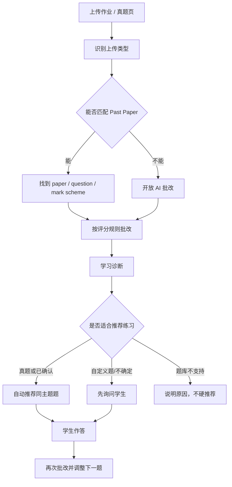

# A-Level Assistant

A-Level Assistant 是一个面向 Cambridge A-Level Mathematics 的 AI 学习诊断系统：学生上传作业或真题页后，系统先尽量匹配 Past Paper 和 Mark Scheme，再给出逐题批改、错因诊断和下一步练习建议。

它不是一个“AI 炫技 dashboard”，也不是只给答案的聊天机器人。产品核心是：

> 让学生知道自己错在哪里、为什么错、今晚下一步该练什么。

## 现在做到哪里

当前 `main` 分支包含一个可运行的全栈 MVP：

- 上传图片/PDF 页面并进行流式批改。
- 识别 Past Paper 场景，优先走 Mark Scheme grounded grading。
- 匹配不到真题时回退到开放 AI 批改。
- 结果页展示学习诊断：得分、错因、薄弱知识点、复核风险。
- 新增 Practice Orchestrator：批改后自动推荐、先询问推荐，或明确不推荐。
- 学生可以在结果页内联完成推荐题，提交后得到评分结果和下一题动作。
- 本地题库目前覆盖 CAIE 9709 结构化题目，适合 P1-P6 路线继续扩展。

## 产品路线



更完整的产品思路见 [docs/PRODUCT.md](docs/PRODUCT.md)。

## 快速人工测试

启动后端：

```bash
cp .env.example .env
pip install -r requirements.txt
python server.py
```

启动前端：

```bash
cd frontend
npm install
npm run dev
```

打开主应用：

```text
http://127.0.0.1:3000/
```

最快测试学习闭环：

```text
http://127.0.0.1:3000/__practice-recommendations-replay
```

在 replay 页面可以直接测试：

1. 第一块自动推荐：点 `开始练习`。
2. 第二块询问式推荐：点 `给我 2-3 道类似题`。
3. 再点 `开始练习`。
4. 输入答案：`x = 3 or x = -1/2`。
5. 点 `提交答案`。
6. 看到 `4/4`、参考答案、评分标准和 `调整下一题`。

## 核心模块

```text
frontend/        React/Vite 前端：上传、批改结果、练习闭环、历史记录
api/             FastAPI 路由：上传、批改、题库、Practice Orchestrator
pipeline/        图片/PDF 加载、分题、提取、批改编排
grader/          题型分类、多 Agent 批改、投票、解题生成
verifier/        确定性校验：代数、统计、概率、化简
formatter/       学生反馈、老师反馈、学习诊断总结
questionbank/    SQLite 题库、Past Paper 和 Mark Scheme helper
spec/            产品规格、视觉规则、验收标准
docs/            产品路线、数据策略、题库方案
agent_workflow/  长任务开发记忆和进度记录
```

## 关键实现

- 后端推荐编排器：[api/practice_orchestrator.py](api/practice_orchestrator.py)
- 结果页练习组件：[frontend/src/components/practice/PracticeRecommendations.tsx](frontend/src/components/practice/PracticeRecommendations.tsx)
- 前端上下文推导：[frontend/src/lib/practiceRecommendationContext.ts](frontend/src/lib/practiceRecommendationContext.ts)
- Replay 验收页：[frontend/src/pages/PracticeRecommendationsReplayPage.tsx](frontend/src/pages/PracticeRecommendationsReplayPage.tsx)
- 产品规格：[spec/product-ui-agent-spec.md](spec/product-ui-agent-spec.md)
- 验收标准：[spec/acceptance.md](spec/acceptance.md)

## 常用验证命令

```bash
# Practice Orchestrator 后端和相关路由
pytest test/test_practice_orchestrator.py test/test_paper_resolver.py test/test_large_pdf_mode.py -q

# 前端练习闭环静态检查和构建
cd frontend
npm run test:practice-context
npm run test:practice-orchestrator
npm run build

# 真实浏览器视觉验收
node ../scripts/visual_acceptance.mjs --path /__practice-recommendations-replay --skip-content-checks
```

## 当前边界

- 真题题库以 Cambridge 9709 数学为核心，当前产品路线优先 P1-P6。
- 非真题或题库外知识点不会强行推荐题目，会先询问或解释不可推荐原因。
- Large PDF Mode 已有规格和部分后端能力，完整前端选页流程仍是后续重点。
- 原始 past paper PDF 不适合直接放入普通 Git 历史，见 [docs/DATA.md](docs/DATA.md)。

## 进一步阅读

- [项目展示文档入口](project-docs/README.md)
- [产品思路](docs/PRODUCT.md)
- [开发路线](docs/ROADMAP.md)
- [数据策略](docs/DATA.md)
- [规则校验与确定性兜底](docs/rule-based-verification.md)
- [Agent 驱动开发与提效系统](docs/agent-driven-development.md)
- [Superpowers 插件使用说明](docs/superpowers-plugin-workflow.md)
- [本地运行](RUN.md)
- [部署指南](DEPLOY.md)
- [题库系统方案](docs/question-bank-proposal.md)
- [长期 Agent 工作流](agent_workflow/README.md)
