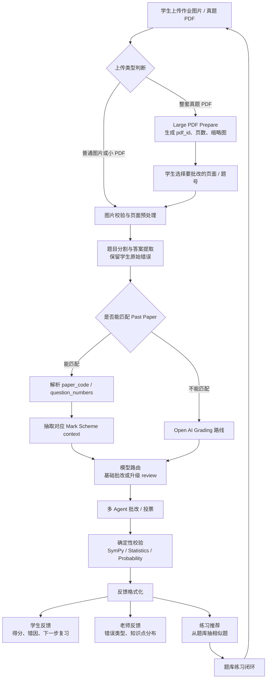

# A-Level Assistant

一个面向 Cambridge A-Level Mathematics 的 AI 学习助手：把学生上传的作业图片、真题页或 PDF 页面，转成结构化批改结果、Mark Scheme 对齐反馈，以及下一步学习建议。

它不是“直接给答案”的通用聊天机器人。这个项目更关注教学诊断：学生哪一步错了、属于什么错误类型、该复习哪个知识点、老师可以从班级错误里看到什么。

## 项目定位

- **学生端**：上传作业或真题页，看到逐题判分、错误原因、改进建议和解题思路。
- **老师端**：从批改结果里看出高频错误、薄弱知识点和后续讲解重点。
- **题库端**：基于 CAIE 9709 真题和 Mark Scheme，支持随机出题、按知识点练习和试卷浏览。
- **工程端**：用多模型路由、多 Agent 投票和确定性数学校验，提升批改稳定性。

## 当前进度

这个仓库已经是一个可运行的全栈 MVP：

- FastAPI 后端：上传、批改、流式进度、反馈、题库 API。
- React/Vite 前端：上传流程、批改结果页、进度时间线、练习模式、历史记录、个人档案。
- SQLite 题库：当前包含 `5536` 道结构化题目。
- Past Paper catalog：当前数据库中有 `468` 条 paper 记录。
- Past Paper 路由：能在匹配真题时注入 question-level Mark Scheme context。
- Large PDF Mode：后端 prepare session 已进入快照；前端选页 UI 仍在开发中。

## 产品工作流



## 核心能力

- 上传作业图片，按题目返回结构化批改结果。
- 通过 SSE 流式展示 `agent_step` 进度，让用户知道系统正在做什么。
- 匹配 CAIE 9709 Past Paper，并优先使用 Mark Scheme grounded grading。
- 在批改 prompt 中注入 question-level Mark Scheme context，而不是只传 PDF 路径。
- 使用 deterministic verifier 校验代数、统计、概率、化简等高风险计算。
- 生成学生可读的学习反馈和老师可读的诊断反馈。
- 从本地结构化题库中按知识点、难度、年份抽题练习。
- 用 `agent_workflow/` 保存长期开发任务、进度和决策，方便 AI agent 接力开发。

## 系统架构

```text
frontend/        React/Vite 前端：上传、批改、练习、历史、个人档案
api/             FastAPI 路由：上传、流式批改、反馈、题库、调试页
pipeline/        图片/PDF 加载、分题、提取、批改编排
grader/          题型分类、批改、多 Agent 投票、解题生成
verifier/        确定性校验：代数、统计、概率、化简
formatter/       学生反馈、老师反馈、总结、知识点和公式提示
router/          模型注册表和模型调用抽象
questionbank/    SQLite 题库访问和 Mark Scheme helper
scraper/         CAIE paper catalog 和真题抓取工具
parser/          PDF 解析和批量入库
reflection/      追问式反思和下一题推荐
memory/          学生薄弱点与事实记忆
agent_workflow/  长期 AI 开发任务记忆和进度记录
spec/            产品规格、验收标准、Large PDF Mode 方案
docs/            技术方案、面试亮点、ADR 和数据说明
```

关键工程约束：

- 模型调用统一经过 `router.models.ModelClient`。
- 运行时链路保持职责分离：`segment -> extract -> grade -> vote -> verify -> format -> render`。
- 提取阶段不能悄悄修正学生错误，必须保留学生原始作答。
- UI 只展示简洁的学习进度说明，不展示 raw chain-of-thought。
- 普通上传路径保持 16 页限制；整套 PDF 通过 Large PDF Mode 的独立 prepare/select/process 流程处理。

## 题库与数据

仓库中包含轻量结构化数据：

- `data/questions.db`：SQLite 题库快照。
- `data/papers_catalog.csv`：Past Paper catalog metadata。

仓库中不包含原始 PDF 题库：

- `data/papers/` 已被 `.gitignore` 忽略。
- 原始 PDF 文件较大，且可能涉及再分发限制。
- 更合适的方式是通过私有备份、对象存储、GitHub Release 或 Git LFS 单独管理。

详细说明见 [docs/DATA.md](docs/DATA.md)。

## 快速启动

```bash
cp .env.example .env
pip install -r requirements.txt
python server.py
```

打开：

```text
http://localhost:8000
```

如果修改了前端源码：

```bash
cd frontend
npm install
npm run build
cd ..
python server.py
```

前后端分开开发：

```bash
python server.py
cd frontend && npm run dev
```

## 常用命令

```bash
# 后端重点测试
pytest test/test_paper_resolver.py test/test_pipeline_mark_scheme.py -q

# Large PDF Mode 后端测试
pytest test/test_large_pdf_mode.py -q

# 前端构建
cd frontend && npm run build

# 视觉验收
cd frontend && npm run test:visual

# 长期任务状态
python scripts/agent_workflow.py status
```

## 环境变量

从 `.env.example` 创建 `.env`。真实 key 不提交进仓库。

主要变量：

- `ANTHROPIC_API_KEY`
- `ANTHROPIC_BASE_URL`
- `DASHSCOPE_API_KEY`
- `DEEPSEEK_API_KEY`
- `GLM_API_KEY`
- `ALLOWED_ORIGINS`

## 开发路线

近期重点：

- 完成 Large PDF Mode 前端选页 UI。
- 接通选中页面的流式批改。
- 增强 paper recognition 和手动确认体验。
- 为桌面和移动端补充视觉验收截图证据。
- 把原始 PDF 题库整理到受控的数据分发渠道，而不是普通 Git 历史。

更完整路线见 [docs/ROADMAP.md](docs/ROADMAP.md)。

## 相关文档

- [本地运行](RUN.md)
- [部署指南](DEPLOY.md)
- [数据策略](docs/DATA.md)
- [产品 UI 规格](spec/product-ui-agent-spec.md)
- [Large PDF Mode 方案](spec/large-pdf-mode.md)
- [验收标准](spec/acceptance.md)
- [题库系统方案](docs/question-bank-proposal.md)
- [长期 Agent 工作流](agent_workflow/README.md)
