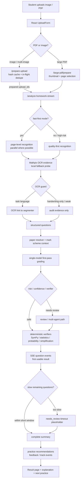

# A-Level Assistant

面向 A-Level 数学学生的拍照批改与学习反馈助手。

学生上传整页作业图片或 PDF 后，系统会把页面切成结构化题目，结合 Past Paper / Mark Scheme 上下文、多个模型批改、确定性数学校验和学习反馈生成，返回每题得分、错误原因、关键步骤反馈、薄弱知识点和下一步练习建议。

## 项目做了什么

这个项目不是一个通用聊天机器人，而是一个围绕 A-Level 数学作业场景做窄域优化的 AI 产品：

- 手机拍照或上传 PDF，支持整页、多页和大 PDF 选择流程。
- Vision segmenter 把题号、题干、学生答案、步骤、分值和图表信息提取成结构化 JSON。
- Past Paper resolver 优先尝试匹配 CIE 真题和 Mark Scheme；无法高置信匹配时回退到开放批改。
- Grader 使用多模型投票和早返回机制，提高正确率同时控制等待时间。
- SymPy、概率、统计、分数化简等确定性验证器对 LLM 结果做二次校准。
- 前端以学习诊断为核心，展示分数、错因、复习主题、解题思路和下一步练习。
- 开发过程结合 Superpowers 插件和仓库内 agent workflow，把 PRD、验收标准、进度记忆和子 agent 分工固化成可重复执行的流程。

## 核心架构



当前主路径是 **fast-first but quality-aware**：图片上传默认走快速首轮批改，首题和已完成题通过 SSE 尽快返回；低置信、空白、跨页、慢题不会被伪装成确定结论，而是通过 `needs_review`、timeout placeholder 和 verifier 暴露风险。PDF、大 PDF、Past Paper、Mark Scheme、推荐练习和反馈埋点都复用同一条后端编排链路。

更完整的后端路径、阶段指标和当前 benchmark 结论见 [Runtime Pipeline And Benchmarks](docs/runtime-pipeline-and-benchmarks.md)。模型角色、环境变量和 OCR 链路见 [Model Routing And OCR Chain](docs/model-routing-and-ocr-chain.md)。

主要目录：

| Path | 作用 |
| --- | --- |
| `frontend/` | React/Vite 前端，包含上传、批改结果、Large PDF、练习推荐和 replay 页面 |
| `api/` | FastAPI 路由、上传缓存、Large PDF、题库推荐和 demo/debug 接口 |
| `pipeline/` | 图片/PDF 处理、切题提取、批改编排和 SSE workflow events |
| `grader/` | 单题批改、多 agent 投票、置信度调整和 verifier 集成 |
| `verifier/` | SymPy、概率、统计、分数化简等确定性兜底 |
| `router/` | 模型抽象、模型注册、升级规则和路由上下文 |
| `questionbank/` / `scraper/` | CIE 题库、Mark Scheme、爬虫和本地 SQLite 数据 |
| `agent_workflow/` | 长任务开发的 agent 记忆、PRD、进度和 durable knowledge |
| `reports/effectiveness/` | 上传链路、批改质量、速度和阶段耗时 benchmark 报告 |

## 三个最重要的方法论

### 1. 规则校验兜底

LLM 负责读图、理解题意和生成教学反馈；确定性工具负责做数学事实校验。这个项目里，OCR、SymPy、概率枚举、统计公式和分数化简检查共同组成了一层安全网。

详细说明见 [规则校验与确定性兜底](docs/rule-based-verification.md)。

### 2. Agent 驱动开发

这个项目的开发不是靠一次性 prompt 写完，而是把 AI 产品经理常用的 PRD、验收标准、任务拆解、证据回收和复盘记忆变成 agent harness。主 agent 负责编排，子 agent 分别做规划、开发、测试和评审。

详细说明见 [Agent 驱动开发与提效系统](docs/agent-driven-development.md)。

### 3. Superpowers 插件工作流

Superpowers 插件在项目里充当「方法层」：它把 brainstorm、spec、plan、subagent execution、review 和 verification 串成可重复执行的开发流程，避免 agent 直接凭感觉写代码。

详细说明见 [Superpowers 插件使用说明](docs/superpowers-plugin-workflow.md)。

## AI 产品经理技巧

这个项目里用到的 AI PM 方法包括：

- 明确用户画像：聚焦 A-Level / CIE 数学学生和一对一老师，而不是泛教育产品。
- 显式目标函数：先定义「30 秒内最高正确率」再倒推多 agent 投票、SSE 和早返回。
- 风险前置：默认 LLM 会幻觉，所以从第一天就设计 verifier、confidence、needs_review 和 fallback。
- 交互掩盖物理等待：用后台预处理、逐题流式返回和进度 timeline 降低体感延迟。
- 可验收交付：每个大功能都有 acceptance criteria、测试命令、截图或 DOM 证据。
- Agent 流程化：用 Superpowers 把模糊需求转成 spec、plan、子任务、评审和验证证据。
- 迭代闭环：从批改结果继续到弱点识别、练习推荐和下一题练习，而不是只给答案。

## 本地运行

本地运行和部署说明见：

- [RUN.md](RUN.md)
- [DEPLOY.md](DEPLOY.md)
- [Runtime Pipeline And Benchmarks](docs/runtime-pipeline-and-benchmarks.md)

常用命令：

```bash
pip install -r requirements.txt
python server.py
```

前端开发：

```bash
cd frontend
npm install
npm run dev
```

## 长任务开发工作流

当任务跨越前端、后端、模型路由和验收截图时，使用仓库内置的 agent workflow：

```bash
python scripts/agent_workflow.py status
python scripts/agent_workflow.py next
python scripts/agent_workflow.py start AW-001 --agent orchestrator --note "Starting"
python scripts/agent_workflow.py complete AW-001 --agent tester --note "pytest + build passed"
```

相关文档：

- [Runtime Pipeline And Benchmarks](docs/runtime-pipeline-and-benchmarks.md)
- [Model Routing And OCR Chain](docs/model-routing-and-ocr-chain.md)
- [规则校验与确定性兜底](docs/rule-based-verification.md)
- [Long-Running Agent Workflow](spec/long-running-agent-workflow.md)
- [ADR-001: Hybrid File Memory And Multi-Agent Orchestration](docs/decisions/ADR-001-long-running-agent-workflow.md)
- [Acceptance Criteria](spec/acceptance.md)
- [Superpowers 插件使用说明](docs/superpowers-plugin-workflow.md)
