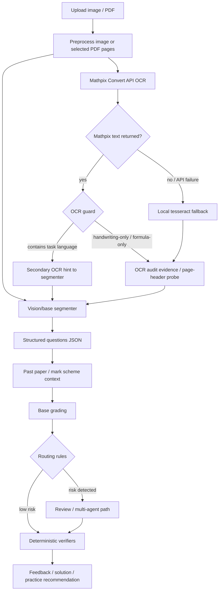

# Model Routing And OCR Chain

This document describes the runtime model chain used by A-Level Assistant and the role of each model. It is meant to be the quick map for future debugging, model swaps, and cost/quality trade-offs.

## Current Local Chain

The current local `.env` resolves to this registry:

| Role | Provider | Model / Engine | Purpose |
| --- | --- | --- | --- |
| `base` | VIVIAI | `gemini-3-flash-preview` | Fast default model for normal grading and text tasks. |
| `vision` | VIVIAI | `gemini-3-flash-preview` | Image-capable segmenter model. When `VISION_MODEL` is empty, it reuses `base`. |
| `ocr` | Mathpix + local fallback | `mathpix:v3/text -> tesseract:eng` | Dedicated OCR evidence layer for page text, math symbols, handwritten work, and header probes. |
| `review` | VIVIAI | `gemini-3-pro-preview` | Slower/stronger reviewer for higher-risk grading. |
| `explain` | VIVIAI | `gemini-2.5-flash-thinking` | Explanation and follow-up tutoring path. |

Secrets are not committed. The concrete values live in `.env`; the public template is `.env.example`.

## End-To-End Chain

## Why OCR Is Guarded

Mathpix is strong at mathematical OCR, but a homework photo can be handwriting-only. In that case Mathpix may correctly extract student working while seeing no printed question stem. If that OCR text is inserted into the segmenter prompt unconditionally, the main model can over-trust it and either blank out `question_text` or treat an intermediate equation as the final answer.

The guard in `pipeline/segmenter.py` prevents that failure mode:

- Mathpix runs in parallel as an evidence layer.
- OCR text enters the prompt only when it appears to contain question/task language such as `find`, `show`, `calculate`, `given`, or similar.
- Formula-only and handwriting-only OCR stays as audit evidence and does not control the segmenter.
- Local tesseract is kept as a weak fallback and page-header probe, not as a full-page math transcription authority.

The regression evidence is in `reports/ocr_compare/demo_input_guarded_stability_20260625_115621.json`. On `static/demo-input.jpg`, which is handwriting-only, the guarded path avoided invented question text and recognized the d-part intersection answer in 3/3 runs, compared with 2/3 for the old no-OCR path.

## Model Selection Rules

`router/models.py::build_registry()` constructs the model registry in this order:

1. `base`
   - If `DASHSCOPE_API_KEY` exists, use DashScope with `BASE_MODEL` or `qwen3.5-plus`.
   - Otherwise use `ANTHROPIC_API_KEY` + `ANTHROPIC_BASE_URL`. For `https://api.viviai.cc`, this is normalized to OpenAI-compatible VIVIAI.

2. `vision`
   - If DashScope and `VISION_MODEL` are set, use that dedicated visual model.
   - Otherwise reuse `base`.

3. `ocr`
   - If both `MATHPIX_APP_ID` and `MATHPIX_APP_KEY` are set, use Mathpix `v3/text`.
   - If local OCR is enabled and available, wrap Mathpix with `FallbackOCRClient`.
   - If Mathpix is not configured and DashScope exists, use `OCR_MODEL` or `qwen-vl-ocr-latest`.
   - If neither Mathpix nor DashScope is configured but `OCR_MODEL` is explicitly set, use the default provider/VIVIAI path.
   - If none of the above applies, use local tesseract only when `LOCAL_OCR_ENABLED=1` and tesseract is available.

4. `review`
   - Prefer DeepSeek when `DEEPSEEK_API_KEY` is set.
   - Otherwise use default/VIVIAI `REVIEW_MODEL`.
   - Otherwise fall back to DashScope.

5. `explain`
   - Prefer DeepSeek when available.
   - Otherwise use default/VIVIAI `EXPLAIN_MODEL`.
   - Otherwise fall back to DashScope.

## Environment Variables

| Variable | Current intent |
| --- | --- |
| `ANTHROPIC_API_KEY` | Default provider key, currently used through VIVIAI. |
| `ANTHROPIC_BASE_URL` | Default provider base URL, currently `https://api.viviai.cc`. |
| `BASE_MODEL` | Fast model for base grading and text tasks. |
| `VISION_MODEL` | Optional dedicated visual model; empty means reuse `base`. |
| `OCR_MODEL` | Optional non-Mathpix OCR model. Keep empty when Mathpix is configured. |
| `MATHPIX_APP_ID` / `MATHPIX_APP_KEY` | Enables Mathpix Convert API OCR. |
| `LOCAL_OCR_ENABLED` | Enables local tesseract fallback/probes. |
| `SEGMENT_OCR_HINT_ENABLED` | Enables guarded OCR prompt hints. |
| `SEGMENT_OCR_HINT_REQUIRE_QUESTION_TEXT` | Requires task-language before OCR text enters segmenter prompt. |
| `REVIEW_MODEL` | Higher-risk review model. |
| `EXPLAIN_MODEL` | Tutor/explanation model. |

## Operational Notes

- Do not put API keys in docs, commits, screenshots, or chat.
- Keep `OCR_MODEL` empty when Mathpix is the desired OCR path; otherwise the code may route non-Mathpix OCR when Mathpix is not configured.
- If a new OCR engine is added, preserve the current principle: OCR may provide evidence, but it must not become the structure authority unless a regression test proves it improves segmentation without hallucinating stems or final answers.
