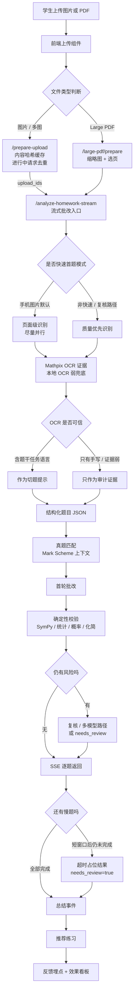

# Runtime Pipeline And Benchmarks

这份文档是当前后端实现路径的主说明。它把上传链路、fast-first 批改策略、OCR/切题、Mark Scheme、verifier、推荐练习、反馈埋点和 benchmark 结果放在一处，方便后续开发、复测和上线前审查。

## 一句话总览

A-Level Assistant 不是“上传图片后等一个大模型回答”的系统。当前实现是一条可观测的学习闭环：

```text
上传
  -> 可选预处理 / 缓存
  -> 流式批改入口
  -> OCR + Vision 切题
  -> 真题 / Mark Scheme 上下文
  -> 快速首轮批改
  -> 确定性规则校验
  -> SSE 逐题返回
  -> 讲解 / 推荐练习
  -> 反馈与效果指标
```

设计取舍是：**先返回可信首轮结果，但不把不确定题伪装成确定结论。** 慢题、低置信题、识别超时题和空白/答案页-only 样本应显示为 `needs_review` 或 timeout placeholder。

## 快速手机模式是做什么的

这里说的“快速手机模式”，代码里主要对应图片上传时的 `fast_batch=true` 路径。它是为真实学生手机拍照场景设计的：学生通常一次拍 1 到多张作业图，图里可能有阴影、倾斜、低清晰度、跨页题、空白题或只写了过程没有题干。如果系统等所有题都完整识别、批改、总结完才显示结果，体感会很慢，学生也不知道是不是卡住了。

快速手机模式解决的是三件事：

- 先返回：只要有题目完成识别和批改，就通过 SSE 先推给前端，不等整页所有题都结束。
- 少重复：`/prepare-upload` 会用图片 hash cache 和 in-flight dedupe，避免同一张图重复识别。
- 不乱判：慢题、低置信题或识别超时题不会硬编分数，而是返回 `needs_review=true` 的占位结果，提示用户复核或重拍。

它不是“降低质量换速度”的模式，而是“先给可用结果，把不确定性显式标出来”的模式。适合手机图片、多图作业和课堂/家教场景；完整 Past Paper PDF 或高风险样本仍会走更保守的路径。

## 最新主流程图



## 详细设计解释

### 1. 上传入口为什么分图片和 PDF

图片和 PDF 的用户意图不同。手机图片通常是“我现在要快点知道这页作业哪里错了”；Large PDF 通常是“我上传了一整套真题，需要先选页”。所以图片默认追求快速首题返回，PDF 则先做缩略图和选页，避免把封面、空白页、答案页一起送进批改。

### 2. `/prepare-upload` 为什么要做缓存和去重

手机端很容易重复提交同一张图：网络抖动、用户重复点击、前端重试都会发生。内容哈希缓存可以让同图复用识别结果，in-flight dedupe 可以让正在识别的同一张图只跑一次。这两个设计不是为了“炫技”，而是直接减少等待时间和模型成本。

### 3. 为什么要流式返回

批改一整页作业时，某一道题可能因为图片模糊、步骤很长或模型响应慢而拖住全页。如果等所有题都完成，用户会觉得系统卡死。SSE 逐题返回让前端先展示已经可靠完成的题，用户可以先看错因和分数，剩余慢题再继续补齐。

### 4. 为什么要有短等待窗口

快速模式不是无限等。系统在第一题返回后，只给剩余慢题一个额外短窗口；如果还没完成，就返回 `needs_review` 占位结果。这样做是为了避免一两道慢题把整次体验拖到 1-2 分钟，同时也避免为了“快”而编造批改结论。

### 5. OCR 为什么只是证据层

OCR 很适合读取打印题干和部分公式，但对手写步骤、倾斜图片、低清晰度照片并不稳定。如果让 OCR 直接主导结构，可能把学生答案当题干，或把错误步骤改成正确表达。因此 OCR 只有在包含真实任务语言时才进入切题提示；否则只保留为审计证据。

### 6. 为什么优先匹配 Past Paper 和 Mark Scheme

A-Level 批改不是只看最终答案，很多题按 method mark、accuracy mark、结论 mark 给分。能匹配真题时，系统优先使用 Mark Scheme 作为评分依据；匹配不到时才回到开放 AI 批改。这个设计的目的，是让批改尽量接近真实阅卷，而不是只像“看起来合理的解释”。

### 7. 为什么还要确定性 verifier

LLM 很会解释，但会算错、漏符号、把等价表达式误判为不等价。SymPy、统计、概率和化简 verifier 负责校准封闭数学事实。它们不是替代老师或模型，而是作为安全网，专门抓那些“语言看起来对、数学事实错”的情况。

### 8. 为什么要 `needs_review`

教育产品里最危险的不是慢，而是给学生一个高置信但错误的结论。`needs_review` 是产品层的诚实机制：当题干缺失、答案保真不足、校验不通过或模型信心不足时，系统把风险显式展示出来，让用户知道这题需要复核或重拍。

### 9. 为什么批改后接推荐练习

只告诉学生“你错了”不够。有效学习闭环要告诉学生下一步练什么，所以系统会把错因、topic、subtopic、真题上下文和题库结合起来，决定自动推荐、先询问，还是不推荐。题库信号不足时不硬推，是为了避免把学生带到错误练习方向。

### 10. 为什么要埋点和 benchmark

这个产品的质量不能只靠主观感觉。上传成功率、首题返回时间、题号召回、判分一致率、`needs_review` 命中率、练习开始率都需要持续追踪。benchmark 的作用是让每次优化都有证据：到底更快了、还是只是把失败藏起来了。

## Frontend Entry Points

| UI surface | Main code | Runtime behavior |
|---|---|---|
| Upload shell | `frontend/src/components/UploadForm.tsx` | Select images/PDF, prepare uploads, submit to streaming analyze |
| Large PDF | `frontend/src/api/largePdfClient.ts` | Prepare PDF, show thumbnails, submit selected pages |
| Result page | `frontend/src/components/QuestionCard.tsx`, `PageSummary.tsx` | Render streamed question results, confidence, feedback, explanations |
| Practice loop | `frontend/src/components/practice/PracticeRecommendations.tsx` | Ask-first or auto recommendations from questionbank |
| Feedback events | `frontend/src/api/client.ts`, `api/feedback.py` | Track UI funnel and benchmark metadata |

Development server:

```bash
python -m uvicorn api.app:app --host 0.0.0.0 --port 8000
cd frontend && npm run dev
```

Vite proxies upload and practice routes to `localhost:8000`.

## Backend Runtime Paths

### 1. Image Upload

Primary files:

- `api/routes.py`
- `api/upload_cache.py`
- `pipeline/pipeline.py`
- `pipeline/segmenter.py`
- `utils/image_utils.py`

Path:

```text
UploadForm
  -> /prepare-upload
  -> upload_cache stores extracted questions by upload_id/content hash
  -> /analyze-homework-stream with fast_batch=true
  -> run_pipeline_streaming(..., fast_batch=True)
```

Important behavior:

- Single image benchmark now matches the real product path by sending `fast_batch=true`.
- `api/upload_cache.py` adds content hash cache and in-flight dedupe.
- Prepared upload results are reused when healthy; recognition timeout cache entries force full fallback instead of silently dropping pages.
- Fast-first mode returns question events as soon as they are ready.
- After the first question has been emitted, pending slow questions get only a short extra window before returning `needs_review` timeout placeholders.

Key knobs:

| Setting | Default | Purpose |
|---|---:|---|
| `FAST_BATCH_PREPARE_TIMEOUT_SECONDS` | `120` | Page recognition budget |
| `FAST_BATCH_QUESTION_TIMEOUT_SECONDS` | `120` | Hard total grading budget before any result |
| `FAST_BATCH_AFTER_FIRST_QUESTION_TIMEOUT_SECONDS` | `25` | Extra wait after first usable question |
| `FAST_BATCH_PREPARE_MAX_WORKERS` | `10` | Prepare/upload recognition concurrency |
| `FAST_BATCH_MAX_WORKERS` | `16` | Fast-first question grading concurrency |

### 2. Large PDF

Primary files:

- `api/routes.py`
- `frontend/src/api/largePdfClient.ts`
- `frontend/src/components/UploadForm.tsx`

Path:

```text
PDF upload
  -> /large-pdf/prepare
  -> thumbnail + default page selection
  -> /large-pdf/{pdf_id}/analyze-stream
  -> run_pipeline_streaming on selected rendered pages
```

The frontend keeps PDF selection explicit, because a large past paper often contains covers, blank pages, mark schemes or answer-only pages.

### 3. OCR And Segmentation

Primary files:

- `pipeline/segmenter.py`
- `router/models.py`
- `utils/image_utils.py`

Current OCR strategy:

- Mathpix is an evidence layer, not the structure authority.
- OCR text enters the segmenter prompt only when the OCR guard sees task language.
- Handwriting-only/formula-only OCR is retained as audit evidence.
- Local tesseract remains a weak fallback and page-header probe.

This prevents handwritten work from overwriting the actual question structure. See [Model Routing And OCR Chain](model-routing-and-ocr-chain.md).

### 4. Paper And Mark Scheme Context

Primary files:

- `api/paper_resolver.py`
- `questionbank/pastpaper_matcher.py`
- `questionbank/mark_scheme.py`
- `pipeline/pipeline.py`

Path:

```text
upload intent + file/header/page clues
  -> paper resolver
  -> questionbank / mark scheme lookup
  -> attach mark_scheme_context per question
  -> grader uses context when confidence is sufficient
```

The resolver should never invent certainty. Medium/low confidence flows should ask for confirmation or fall back to open grading.

### 5. Grading And Verification

Primary files:

- `grader/grader.py`
- `pipeline/pipeline.py`
- `verifier/statistics_verifier.py`
- `verifier/math_verifier.py`
- `verifier/probability_verifier.py`
- `verifier/simplification_verifier.py`

Current strategy:

- First-pass grading is fast and streamed.
- Risky cases use review/multi-agent paths when enabled.
- Deterministic verifiers can correct or flag LLM grading for closed-form math.
- `needs_review=true` is preferred over a confident wrong answer.

Fast-first mode deliberately disables inline solution generation and heavy summary LLM calls; deeper explanation remains available through follow-up actions.

### 6. Practice Recommendation

Primary files:

- `api/practice_orchestrator.py`
- `questionbank/database.py`
- `frontend/src/components/practice/PracticeRecommendations.tsx`

Inputs:

- `priority_topics`
- `knowledge_tags_summary`
- wrong/unanswered questions
- upload intent and paper context

Outputs:

- `auto`: enough topic/paper confidence, return real questionbank items.
- `ask_first`: topic is plausible but needs student confirmation.
- `none`: insufficient signal.

The evaluator accepts narrow topic aliases such as `sigma_notation` within the statistics group to avoid false negative recommendation scores.

## Telemetry And Effectiveness Metrics

Primary files:

- `api/feedback.py`
- `api/effectiveness.py`
- `scripts/evaluate_upload_corpus.py`
- `scripts/build_jpeg_benchmark_corpus.py`

Important events/metrics:

| Metric | Meaning |
|---|---|
| `upload_success_rate` | Request completed successfully |
| `parse_success_rate` | At least one readable question extracted |
| `readable_question_rate` | Question-level readable/non-timeout rate |
| `first_question_p95_ms` | User-facing first result latency |
| `image_end_to_end_p95_ms` | Full image session latency |
| `sse_first_event_p95_ms` | Transport/proxy responsiveness |
| `segmentation_done_p95_ms` | Recognition/cutting latency |
| `first_grading_after_segmentation_p95_ms` | First grading latency after segmentation |
| `summary_after_first_question_p95_ms` | How long slow remaining questions delay the page |
| `recognition_timeout_count` | Recognition hard failures |
| `fast_batch_timeout_count` | Question grading hard fallbacks |
| `marked_correctness_match_rate` | Labeled quality benchmark correctness |
| `recommendation_relevance_rate` | Labeled recommendation topic relevance |

## Current Benchmark Status

Latest focused reports:

- `reports/effectiveness/20260626_fast_first_single_image_report.md`
- `reports/effectiveness/20260626_jpeg30_phase_benchmark_report.md`
- `reports/effectiveness/20260626_quality_speed_iteration_report.md`

Stable wins:

| Area | Latest evidence |
|---|---|
| 10-image prepared batch | Overall pass 100, 20/20 correct, first question 4.244s |
| Product-path single JPEG | Overall pass 100 on seed corpus, first question 24.618s |
| Fixed 30-image corpus | Upload success 100%, parse success 100%, readable question rate 100% |
| Backend focused regression | 72 passed, 1 skipped |
| Frontend build | Passes; Vite chunk-size warning remains |

Known failures from JPEG30:

| Metric | Result | Target |
|---|---:|---:|
| `image_end_to_end_p95_ms` | 131.071s | 60s |
| `first_question_p95_ms` | 88.901s | 30s |
| `segmentation_done_p95_ms` | 77.197s | 20s |
| `first_grading_after_segmentation_p95_ms` | 34.809s | 15s |
| `summary_after_first_question_p95_ms` | 113.997s before the short-window fix | 15s |
| `fast_batch_timeout_count` | 2 | 0 |

Interpretation:

- SSE/proxy is fast; the bottleneck is not transport.
- Tilted/shadow and cross-page photos are recognition long-tail cases.
- Blank/answer-only images should be rule-detected earlier instead of sent through full grading.
- Before the latest short-window fix, later slow questions could delay the page even when the first question was already available.

## Current Optimization Direction

Priority order:

1. Keep fast-first short-window behavior: after the first question, do not let slow pending questions block the whole page for 120s.
2. Add blank/answer-only lightweight detection before grading.
3. Add image quality scoring for tilt, shadow, crop risk and show retake guidance.
4. Add repeat benchmark for the 30-image corpus after each performance change.
5. Label the 30-image corpus with expected question count/order/score so it becomes both a speed and quality benchmark.
6. Split frontend bundles, especially PDF worker and non-first-screen demo/practice code.

## Verification Commands

Focused backend:

```bash
PYTHONPATH=. pytest -q \
  test/test_pipeline_streaming.py \
  test/test_fast_upload_flow.py \
  test/test_effectiveness.py \
  test/test_large_pdf_mode.py
```

Broader backend set used in recent iterations:

```bash
PYTHONPATH=. pytest -q \
  test/test_statistics_verifier.py \
  test/test_fast_upload_flow.py \
  test/test_pipeline_streaming.py \
  test/test_effectiveness.py \
  test/test_large_pdf_mode.py \
  test/test_practice_orchestrator.py \
  test/test_rescue_bridging.py \
  test/test_feedback_metrics_dashboard.py
```

Frontend:

```bash
cd frontend
npm run build
```

Benchmark corpus:

```bash
python scripts/build_jpeg_benchmark_corpus.py \
  --output-dir test/fixtures/jpeg_benchmark_corpus \
  --count 30

python scripts/evaluate_upload_corpus.py \
  --input-dir test/fixtures/jpeg_benchmark_corpus \
  --api-base http://127.0.0.1:8000 \
  --repeat 1 \
  --max-concurrency 1 \
  --track-events \
  --output reports/effectiveness/jpeg30_fast_first_phase_metrics_YYYYMMDD.json
```

## What Not To Change Casually

- Do not let OCR unconditionally rewrite segmenter output.
- Do not hide uncertainty by dropping timeout/unreadable placeholder questions.
- Do not make fast-first generate inline solutions before first result.
- Do not widen topic aliases without a matching benchmark sample or human review note.
- Do not optimize speed by lowering `needs_review` visibility.
