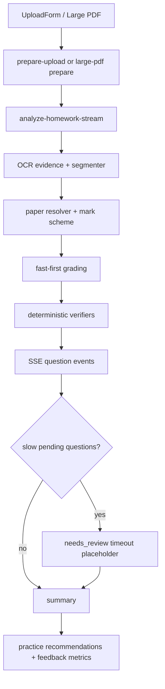

# 2026-06-26 Backend Implementation Path

这份报告原本记录“上传 → 识别 → 批改 → 校验 → 讲解 → 练习 → 反馈”的后端实现路径。随着 fast-first、阶段耗时指标、JPEG30 benchmark 和短等待窗口陆续加入，原报告已经不适合作为唯一入口。

当前请以这份新版主文档为准：

- [Runtime Pipeline And Benchmarks](../../docs/runtime-pipeline-and-benchmarks.md)

## 当前版本摘要

## What Changed Since The First Version

- Single JPEG benchmark now uses the same `fast_batch=true` path as the product UI.
- `/prepare-upload` has content hash cache and in-flight dedupe.
- Fast-first mode streams question results and no longer waits the full 120s for every pending question after the first usable result.
- The evaluator records phase timings:
  - `sse_first_event_ms`
  - `segmentation_done_ms`
  - `first_grading_after_segmentation_ms`
  - `summary_after_first_question_ms`
- A deterministic 30-image JPEG corpus now lives at `test/fixtures/jpeg_benchmark_corpus`.
- `api/effectiveness.py` reports upload, parse, quality, recommendation and phase-latency metrics.

## Latest Verification Snapshot

- Focused backend regression: `45 passed`.
- Broader recent backend regression: `72 passed, 1 skipped`.
- Frontend build: passed, with the existing Vite chunk-size warning.
- JPEG30 benchmark: stable upload/parse, but long-tail latency remains above target.

## Remaining P0 Work

1. Add blank/answer-only early detection before expensive grading.
2. Add image quality scoring for tilt/shadow/crop risk.
3. Re-run JPEG30 after each performance change and compare phase metrics.
4. Label JPEG30 with expected question count/order/score so speed and quality can be judged together.
